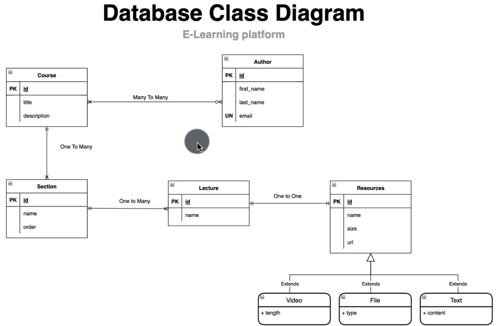

### Credit: https://aliboucoding.com

For more tutorials and videos check my youtube channel or my personal website

Youtube: https://www.youtube.com/watch?v=LSPWnwFhpJI&list=PL41m5U3u3wwkS8BU0fIeRQwY3hK4VlFlX

Website: https://aliboucoding.com

## SQL Diagram

- Note: Course <--> Author is Many-to-Many relationship, but a course must have at least 1 Author
- An Author may not have any course
- View 
